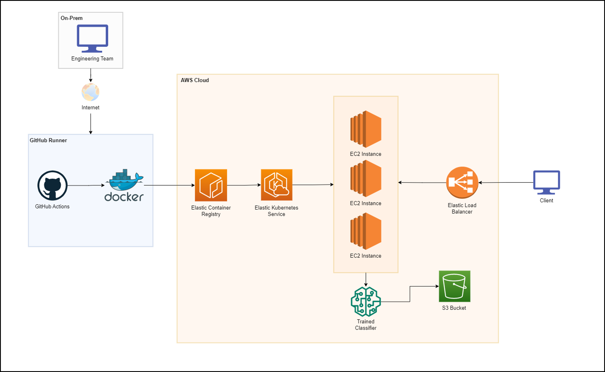

# Intel Cloud Optimization Modules for Kubernetes
This project serves as a template with codified Intel accelerations covering various AI workloads
## Solution Architecture 

The architecture uses Docker for application containerization and Elastic Container (ECR) Storage on AWS. The application image is then deployed on a cluster managed by Elastic Kubernetes Service (EKS). Our clusters are made up of EC2 instances. We use S3 for storing data and model objects, which are retrieved during various steps of our ML pipeline. The client interacts with our infrastructure through our Elastic Load Balancer, which gets provisioned by our Kubernetes service.

  